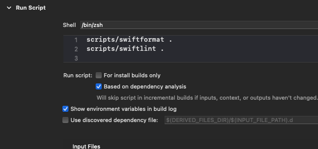

# Installation and running scripts

- Install [swiftlint](https://github.com/realm/SwiftLint) with command: `brew install swiftlint`
- Install [swiftformat](https://github.com/nicklockwood/SwiftFormat) with command: `brew install swiftformat `
- Add in your project in a folder called _scripts_ the two scripts below
- **swiftformat** :

```
#!/bin/zsh

REQUIRED_SWIFTFORMAT_VERSION='0.48.11'

if ! type swiftformat > /dev/null; then
  echo "swiftformat not installed, exiting..."
  exit 255
fi

CURRENT_SWIFTFORMAT_VERSION=$(swiftformat --version)

if [ $CURRENT_SWIFTFORMAT_VERSION != $REQUIRED_SWIFTFORMAT_VERSION ]; then
    echo "swiftformat required version $REQUIRED_SWIFTFORMAT_VERSION, current version $CURRENT_SWIFTFORMAT_VERSION"
	exit 255
else
    swiftformat $1
fi

```

- **swiftlint** :

```
#!/bin/zsh

REQUIRED_SWIFTLINT_VERSION='0.44.0'

if ! type swiftlint > /dev/null; then
  echo "swiftlint not installed, exiting..."
  exit 255
fi

CURRENT_SWIFTLINT_VERSION=$(swiftlint --version)

if [ $CURRENT_SWIFTLINT_VERSION != $REQUIRED_SWIFTLINT_VERSION ]; then
    echo "swiftlint required version $REQUIRED_SWIFTLINT_VERSION, current version $CURRENT_SWIFTLINT_VERSION"
	exit 255
else
    swiftlint lint $1
fi
```

you can find the files in the scripts directory

and make them runnable: `cdmod 775 FileName` from terminal

- open the project in xCode
- go to app -> Build Phases -> open Run Scripts
- edit like this:



- run the app
