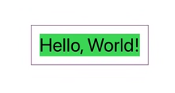
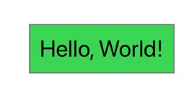
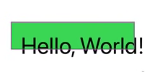
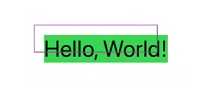
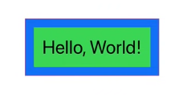

# 8 Common mistakes to avoid in SwiftUI

## 1) Add views and modifiers where there aren't needed.

Basically if you are doing this mistake you are writing more swiftUI code than you actually need to write.

Ex: if you want to have a color in your view, insteand of write this: 
```swift
  Rectangle()
      .fill(Color.red)
```
you can literally just write
```swift
  Color.red
```
and the result will be the same because all the swiftUI shapes or color automatically already confomed to the view protocol

## 2) Using `@ObservedObject` when you mean `@StateObject`

ex.
```swift
class DataModel: ObservableObject {
  @Published var username = "Hello, World!"
}
struct ContentView: View {
@ObservedObject var model = DataModel() 
var body: some View { 
      Text(model.username)
  }
}
```
This is gonna work most of the time, but occasionally, randmoly, it fails and this is the wrong modifier wrapper to use.
```swift
class DataModel: Observable0bject {
  @Published var username = "Hello, World!"
}
struct ContentView: View {
@StateObject var model = DataModel() 
var body: some View { 
      Text(model.username)
  }
}
```
You need to use `@StateObject` when you create your data in the view, because it means that this view owns, creates and manages the data.
With `@ObservedObject` you're not getting this ownership, 
someone else should create and pass it (imagine this while navigating accross view and the `@ObservedObject` 
has been destroyed from SwiftUI and the model is not alive anymore)

## 3) Putting modifiers in the wrong order

Remember that in SwiftUI the modifier are applied from the latest to the first in order of lines 
```swift
      Text("Hello, World!")
          .font(.largeTitle)
          .background(Color.green)
          .padding()
  ```
  
  
in this case we are appling the padding, than the background, and than the font, so the background is green and than there is some transparent padding

```swift
      Text("Hello, World!")
          .font(.largeTitle)
          .padding()
          .background(Color.green)
  ```
  

but if you do like this example above, the green backgroud will include the padding.

Maybe this is the result you want, but wait a second, let's try with something more complex, like `offset`:
```swift
      Text("Hello, World!")
          .font(.largeTitle)
          .offset(x: 15, y: 15)
          .background(Color.green)
  ```


```swift
      Text("Hello, World!")
          .font(.largeTitle)
          .background(Color.green)
          .offset(x: 15, y: 15)
  ```


Notice the difference :D, now, try by yourself with `.position(x: 100, y: 100)` and try to swipe it with the `.background(Color.green)` and see the huge difference.

Remember, when you're adding a modifier is like adding a new "view" each time to the other, see the example below:

```swift
      Text("Hello, World!")
          .font(.largeTitle)
          .padding()
          .background(Color.green)
          .padding()
          .background(Color.blue)
  ```


## 4) Attaching property observer to property wrappers

to explaing this we need an example, having a `Slider` with a `rating` value, you want to observe his changes like this:

```swift
// slider value
@State private var rating = 0.0 {
  didSet{
    print("Rating changed to \(rating)")
  }
}

var body : some View {
  Slider(value: $rating)
}
```

now you will see that the `didSet` is not triggered, and nothing is printed. 

This happens because the value's being chenged directly inside the `@State` property, 
but the state struct wrapper arount it is not changing, just the internal value only.

To fix it, you need to use the `OnChange` modifier:

```swift
// slider value
@State private var rating = 0.0

var body : some View {
  Slider(value: $rating)
    .onChange(of: rating) { value in
        print("Rating changed to \(value)")
    }
}
```
and now every time the slider value changes, you will have a printed value!

### 5) Stroking shapes when you mean to stroke their border

Insteand of doing a stroke in all the shape
```swift
Circle()
  .stroke(Color.red, lineWidth: 20)
```

creating a shape what goes outside the screen, sometimes you just want to stroke only the border of the shape:

```swift
Circle()
  .strokeBorder(Color.red, lineWidth: 20)
```
and so the stroke is drawn only inside the shape

### 6) Using alerts and sheets with optionals

Imagine having a `User` struct optional, and you want to present an alert when a button is clicked
```swift
struct User : Identifiable {
    let id : String
}
```
then inside your ContentView:
```swift
@State private var selectedUser: User?
//Whether the alert must be shown
@State private var showingAlert = false

var body : some View {
  VStack{
    Button("show alert"){
      selectedUser = User(id: "@GabM3")
      showingAlert = true
    }
  }
  //here you are observing then the value became true
  .alert(isPresented: $showingAlert){
    Alert(title: Text("Hello, \(selectedUser!.id)"))
  }
}
``` 
this works, but there is a better way to handle the optional value of `User`, using the unsafeUnwrap is not recommended

```swift
@State private var selectedUser: User? 

var body : some View {
  VStack{
    Button("show alert"){
      selectedUser = User(id: "@GabM3") 
    }
  }
  //watch that value of the user when is not nil
  // and pass it to the content when is set or changes
  .alert(item: $selectedUser){ user in
    Alert(title: Text("Hello, \(user.id)"))
  }
}
``` 

### 7) Trying to get “behind” your SwiftUI views

in this case you want a full red background
```swift 
var body : some View {
  Text("Hello, World!")
    .background(Color.red)
}
``` 
but if you do like this, you obtain only the `Text` with the red background and not all the screen.

And thinking to how to do this, maybe you can think that behind your text there is another view.

But there is a simplier solution: make the `Text` fill the full screen (if it is the only part of your screen obviusly)
```swift 
var body : some View {
  Text("Hello, World!")
    .frame(maxWidth: .infinity, maxHeight: .infinity)
    .background(Color.red)
    .ignoreSafeArea()
}
```
and now it fill the complete screen

### 8) Creating dynamic views using invalid ranges

Let's suppose that you want to have a list of 4 items and a button to add rows
```swift 
@State private var rowCount = 4
var body : some View {
  VStack{ 
    Button("Add Row"){
      rowCount += 1
    }
    .padding(.top)
    List(0..<rowCount){ row in 
      Text("Row \(row)")
      }
  }
}
```
it becames a problem if you try to edit this range at runtime (clicking the button, or think if you have async data fetching in)

to fix it you just need an id for the view:

```swift 
@State private var rowCount = 4
var body : some View {
  VStack{ 
    Button("Add Row"){
      rowCount += 1
    }
    List(0..<rowCount, id: \.self){ row in 
      Text("Row \(row)")
      }
  }
}
```
so swiftUI know the range is gonna change.


# the End 

thanks to [Paul Hudson](https://twitter.com/twostraws) [video](https://www.youtube.com/watch?v=qkcKTJhDyLs) to help me doing this file
